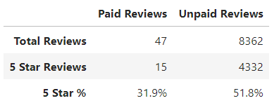

# Amazon Vine Analysis

## Overview

This analysis was conducted in order to test the effectiveness of the Amazon Vine Program, which is a program where companies pay to have their products reviewed. I used Amazon watch data to preform this analysis.

## Results

The results show that the number of paid reviews is very small compared to the unpaid reviews and that the percentage of reviews that get a 5 star rating is considerably lower as well.

## Summary

I would conclude that there is no positivity bias towards the paid reviews, in fact the results show the opposite. I beleive this is because the people that were paid to review these products didn't necessarily have a prior interest in the product leading to them leaving a harsher review. Whereas customers who bought the products through their own volition will be more easily satisfied given there prior interest in the product.
